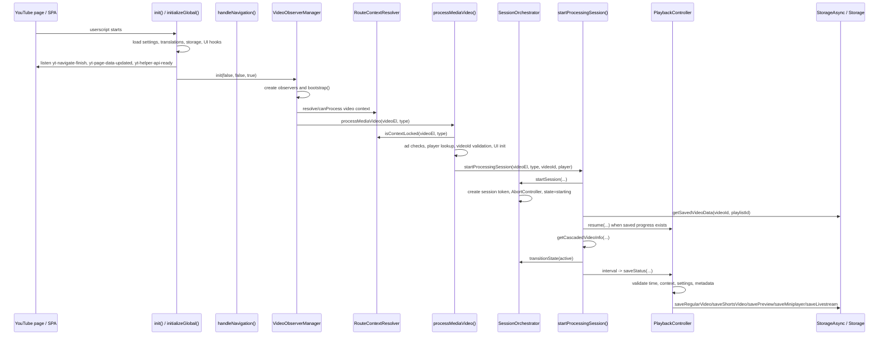
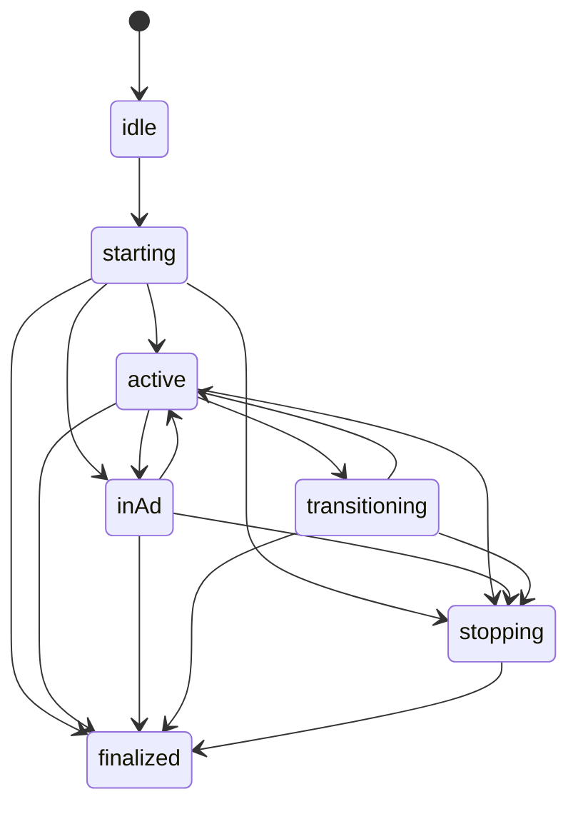

# Operation Flow: Page Load to Saved Playback Entry

This document describes the operational flow of the userscript from when YouTube loads or navigates through SPA until the progress ends up saved in storage.

## Scope

The main path covers:

- Initialization of the global script.
- Synchronization with YouTube navigation events and YouTube Helper API.
- Video detection by `VideoObserverManager`.
- Context resolution by `RouteContextResolver`.
- Unified entry point `processMediaVideo()`.
- Creation, control and cleanup of sessions with `SessionOrchestrator`.
- Initial resume and periodic saves with `PlaybackController`.
- Final persistence through specialized save helpers and `Storage`.

The contexts supported by this flow are `watch`, `shorts`, `miniplayer` and `preview`.

## High-Level Sequence



## Phase 1: Initial Load

`init()` calls `initializeGlobal()` once. `initializeGlobal()` is guarded by `initializationPromise`, so duplicate initialization attempts wait for the same promise instead of creating parallel systems.

Main work done during initialization:

- Registers debounced navigation handlers for `yt-navigate-finish` and `yt-page-data-updated`.
- Registers `yt-helper-api-ready` when YouTube Helper API is available.
- Loads translations and settings into `cachedSettings`.
- Initializes `StorageAsync`, then runs `cleanupNonVideoData()`.
- Registers menu commands, progress bar CSS, theme observers, and optional floating UI.
- Starts `VideoObserverManager.init(false, false, true)`.

The first `VideoObserverManager.init()` uses `skipCleanup=true` because there may already be a navigation-triggered session in flight. This avoids immediately killing a session created during the same load race.

## Phase 2: Navigation Synchronization

`handleNavigation()` is the SPA coordinator. It updates:

- `currentPageType` from `getYouTubePageType()`.
- `lastHandledVideoId`.
- `lastHandledPageType`.

It avoids destructive reinitialization when:

- The same Watch or Shorts video already has an active session.
- The same page/video was just handled but the player appeared late.
- A non-watch page preserves an active miniplayer session.
- A browse/home-like page preserves an active preview session.

When a real route change is detected, it:

- Clears DOM caches through `DOMHelpers.clearAll()`.
- Clears video type cache through `VideoObserverManager.clearCache()`.
- Reinitializes observers with:
  - `forceBootstrap = !preserveMiniplayer`
  - `preserveMiniplayer = currentPageType !== 'watch'`
  - `skipCleanup = preserveMiniplayer`

This is the main guard against YouTube SPA churn causing repeated teardown, duplicate sessions, or repeated seek.

## Phase 3: Video Detection

`VideoObserverManager` owns detection and requeueing. It keeps:

- `videoTypeCache`: `WeakMap<HTMLVideoElement, type>` to dedupe element/type pairs.
- `pendingVideos`: `Set<HTMLVideoElement>` batch queue.
- `activeAdWaiters`: `WeakSet` for videos waiting for ad state to clear.
- `miniplayerTransitions`: `Set` because miniplayer handoff needs iteration-like state.
- Four MutationObservers: Watch, Shorts, Miniplayer, Preview.

### Bootstrap

`bootstrap(force)` scans for already-present videos:

- Watch: uses `waitForWatchPlayerReactive(force)`.
- Shorts: uses `DOMHelpers.getShortsPlayerVideo()`.
- Miniplayer: uses `DOMHelpers.getMiniplayerPlayerVideo()` and a delayed retry.
- Preview: uses `DOMHelpers.getInlinePreviewPlayerVideo()` only outside Watch/Shorts and when miniplayer is not active.

Watch has a special reactive wait loop because `#movie_player` may appear late or be replaced by other scripts.

### Observers

Watch observer:

- Only runs on `currentPageType === 'watch'`.
- Detects `<video src>` changes and added videos under `#movie_player`.
- Ignores videos physically inside `ytd-miniplayer`.
- Treats same-video `src` changes as player setting changes and marks `session.isPlayerSettingsChange`.

Shorts observer:

- Only runs on `currentPageType === 'shorts'`.
- Detects `src` mutations and added videos under `#shorts-player`.
- Clears stale `playerVideoIdCache` and previous session state before requeue.

Miniplayer observer:

- Does not process on Watch pages.
- Tracks `miniplayer-is-active` on `ytd-app`.
- Destroys miniplayer UI when hidden.
- Marks `miniplayerTransitions` on real `src` changes so `startProcessingSession()` can hand off rather than dead-stop.

Preview observer:

- Does not run on Watch or Shorts pages.
- Filters out mutations caused by YPP UI.
- Detects `src` changes in inline preview players.
- Clears `yppShortsPreview` dataset cache when the preview source changes.
- Marks `previewTransitions` to allow controlled handoff.

### Enqueue

`enqueueVideo(videoElement, type, triggerSource)` applies the first hard filters:

1. `EventPreFilter.shouldDrop()` rejects non-video, disconnected, or src-less elements.
2. `RouteContextResolver.canProcessContext()` checks page/context eligibility.
3. `AdDetector.isNodeWithinAdContainer()` blocks ads and schedules `scheduleAdRecovery()`.
4. `videoTypeCache` prevents redundant enqueue for the same element/type.
5. The element is added to `pendingVideos`, then `processBatch()` is scheduled.

`processBatch()` resolves the actual context again, validates it, and calls `processMediaVideo(video, type)`.

## Phase 4: Context Resolution

`RouteContextResolver` prevents cross-player contamination. It scores candidate contexts by:

- Whether the video belongs to the expected root.
- Visibility.
- Playing state.
- Ready state.
- Whether `src` exists.
- Page type penalties for Watch/Shorts mismatch.
- Preview penalty while miniplayer exists.

It uses short stickiness (`SCORE_STICKINESS_MS`) to avoid context flapping during rapid DOM transitions.

Important APIs:

- `resolveContext(videoEl, preferredContext)`
- `canProcessContext(videoEl, context)`
- `getIneligibilityReason(videoEl, context)`
- `isContextLocked(videoEl, expectedContext)`

`isContextLocked()` is checked at multiple boundaries: enqueue, processing, session start, and save.

## Phase 5: Unified Processing Entry

`processMediaVideo(videoEl, type)` is the single entry point after detection. Its behavior is configured by `PROCESS_MEDIA_VIDEO_CONFIG`.

Shared pipeline:

1. Confirm `RouteContextResolver.isContextLocked(videoEl, type)`.
2. Run optional `beforeAdCheck`.
3. Reject ads with `AdDetector.isNodeWithinAdContainer(videoEl)`.
4. Run optional `afterAdCheck`.
5. Resolve the correct player.
6. Run optional `afterPlayerResolved`.
7. Resolve and validate `videoId`.
8. Ensure the context-specific time display through `PlaybackDisplayManager`.
9. Call `startProcessingSession(videoEl, type, videoId, player)`.

Context-specific hooks:

| Context | Player | Critical behavior |
|---|---|---|
| `watch` | `DOMHelpers.getWatchPlayer()` | Requires `currentPageType === 'watch'` and player videoId matching URL ID. |
| `shorts` | `DOMHelpers.getShortsPlayer()` | Requires `currentPageType === 'shorts'` and player videoId matching URL ID. |
| `miniplayer` | `DOMHelpers.getMiniplayerPlayer()` | Allows missing player long enough to log inactive state; clears stale `playerVideoIdCache`; prioritizes local player ID over Helper API ID. |
| `preview` | `DOMHelpers.getInlinePreviewPlayer()` | Skips when active miniplayer is playing; debounces 150ms; resolves ID from tile href before player ID; blocks ad-associated IDs. |

This structure removes duplicated start logic while keeping the fragile YouTube-specific safeguards local to each context.

## Phase 6: Session Creation

`startProcessingSession(videoEl, type, videoId, player)` is the runtime bridge between a detected video and periodic saving.

Before creating a session it:

- Captures `globalNavigationId`.
- Lets `FailSafeManager` exit safe mode if stable.
- Confirms context lock.
- Avoids duplicate sessions for the same element/type/video.
- Finalizes stale sessions on the same video element when the ID changed.
- Clears playback messages for that context.

Then it calls `SessionOrchestrator.startSession(...)`.

### SessionOrchestrator

`SessionOrchestrator` owns state and cleanup for entries in `activeProcessingSessions`.

State model:



`startSession()` creates:

- `sessionId`
- `sessionToken`
- `transitionToken`
- `identityKey`
- `weakMediaFingerprint`
- `AbortController`
- Initial state `starting`

It rejects duplicate starts using:

- `dedupeByKey` with `DEDUPE_MS`.
- Active same element/type/video checks.
- Context max-session invariant telemetry.

`finalizeSession(videoEl, reason)`:

- Transitions to stopping/finalized.
- Clears `intervalId`.
- Aborts the session `AbortController`.
- Clears fallback timers.
- Deletes from `activeProcessingSessions`.
- Emits telemetry.

`handoffSession(videoEl, toVideoId, reason, mode)`:

- Marks the old session as transitioning.
- Finalizes it.
- Starts a new session for the same context and new videoId.

## Phase 7: Resume and Metadata

After `SessionOrchestrator.startSession()` accepts:

1. The script stores fresh dataset guards on the `<video>`:
   - `sessionStartTime`
   - clears stale `lastSavedTime`
   - clears stale `lastResumedTime`
2. It builds fast metadata:
   - `videoId`
   - fast playlist ID
   - duration from player or video element
3. It starts an async storage lookup:
   - `getSavedVideoData(videoId, fastPlaylistId)`
4. If saved data exists and the session is still current:
   - UI state is synced.
   - completion-zone guard may set `hasLoggedCompletion`.
   - `PlaybackController.resume(...)` applies seek if appropriate.
5. In parallel, `getCascadedVideoInfo(player, videoId, videoEl, type)` resolves fuller metadata.

After the metadata await, the mandatory async-session checks run:

- `activeProcessingSessions.get(videoEl) === sessionRef`
- `!sessionRef.isFinalized`
- `navIdAtStart === globalNavigationId`, except miniplayer has a deliberate navigation exception.

If the session survived, metadata is merged into `sessionRef.videoInfo`.

## Phase 8: Save Interval

If autosave is enabled for the context, `startProcessingSession()` creates an interval using:

```text
max(cachedSettings.minSecondsBetweenSaves || 1, 1) * 1000
```

Each tick:

1. Self-destructs if the active session is gone, replaced, or finalized.
2. Runs Watch UI watchdog every fourth tick.
3. Runs Persistence Rescue at tick 6 if a resume should have happened but playback is still near `0s`.
4. Returns early while `sessionRef.isResumePending`.
5. Evaluates kill-switch conditions:
   - Video disconnected.
   - Ad detected.
   - Player video ID changed.
   - Preview/miniplayer hidden ghost.
6. Handles controlled handoffs:
   - Preview transitions via `previewTransitions`.
   - Miniplayer transitions via `VideoObserverManager.hasMiniplayerTransition(videoEl)`.
7. Finalizes and schedules ad recovery when the current video became an ad.
8. Calls `PlaybackController.saveStatus(player, videoEl, type, videoId, session.videoInfo)`.
9. Updates `session.videoInfo` if save returned fresher metadata.
10. Playback notifications flow through `notifySeekOrProgress()` into `PlaybackDisplayManager.show()`, which decides the target display, message priority, timeout, and listener cleanup.

The interval ID is assigned immediately to `sessionRef.intervalId`, before the final `Object.assign`, so `finalizeSession()` can always clear it.

## Phase 9: saveStatus Eligibility

`PlaybackController.saveStatus()` is the final gate before persistence.

It rejects when:

- `videoEl` or `videoId` is missing.
- The element is inside an ad container.
- Context lock fails.
- The active session is missing or finalized.
- Another non-manual save is already running for the same session.
- Current time or duration is invalid.
- Native YouTube resume appears to have moved playback backwards.
- The time did not change meaningfully.
- YouTube reset playback shortly after load/resume.
- The video is paused and there was no meaningful seek.
- Metadata is still missing after refresh.
- Autosave is disabled for the final type.

If eligible, it:

- Stores `lastSavedTime` before async work to block rapid duplicate ticks.
- Refreshes metadata if needed, throttled by `lastMetaFetch`.
- Converts Watch to Miniplayer when the active miniplayer element indicates that transition.
- Lets live streams override the final type.
- Updates progress bar gradient.
- Emits `saveDecision` telemetry.
- Rounds duration into `videoInfo.lengthSeconds`.

Then it delegates by final type:

| Final type | Save function |
|---|---|
| `live` | `saveLivestream(...)` |
| `shorts` | `saveShortsVideo(...)` |
| `preview` | `savePreview(...)` |
| `watch` | `saveRegularVideo(...)` |
| `miniplayer` | `saveMiniplayer(...)` |

Preview additionally resolves `preview_watch` vs `preview_shorts` using a per-element dataset cache.

Successful results update manual-save UI, notify progress, attach `videoInfo` to the result, and release `session.isSaving` in `finally`.

## Phase 10: Persistence Boundary

The specialized save functions build the normalized video record and write through the storage layer. The project rule is that storage operations are async and must be awaited.

At this point the session pipeline has already provided:

- A stable `videoId`.
- A resolved playback context.
- Current playback time.
- Duration.
- Metadata from `getCascadedVideoInfo()`.
- User settings eligibility.
- Ad/context/session safety checks.

The storage write is therefore the last step, not the place where routing is decided.

## Recovery Paths

### Ad Recovery

When a video is blocked as an ad before or during a session:

- `VideoObserverManager.waitForAdClear()` registers `timeupdate`, `play`, and a 2s interval.
- It periodically checks `AdDetector.isNodeWithinAdContainer(videoElement)`.
- Once clear, it enqueues the same element/type again.

### Fallback Manager

`SessionFallbackManager.ensureForSession()` sets short-lived retry/watchdog timers for active sessions. It re-enqueues only when:

- The session token still matches.
- The session is not finalized.
- The context lock still holds.
- Retry TTL has not expired.

### Safe Mode

`FailSafeManager` tracks repeated invalid transitions, duplicate sessions, and invariant violations. Under repeated instability it enters safe mode, where complex transition handoffs degrade to finalize-and-requeue behavior.

## Practical Debugging Path

When debugging a missing save, inspect in this order:

1. Did `initializeGlobal()` complete and call `VideoObserverManager.init()`?
2. Did `handleNavigation()` skip a needed bootstrap because it considered the route redundant?
3. Did `bootstrap()` or an observer find the correct `<video>`?
4. Did `enqueueVideo()` reject it? Check `getIneligibilityReason()`.
5. Did `processMediaVideo()` reject it because of page mismatch, ad state, missing player, or videoId mismatch?
6. Did `SessionOrchestrator.startSession()` reject due to dedupe or already-active session?
7. Did `getCascadedVideoInfo()` await invalidate the session before interval creation?
8. Did the save interval self-destruct because the session was replaced or finalized?
9. Did `PlaybackController.saveStatus()` reject due to context mismatch, invalid metrics, resume protection, paused state, missing metadata, or disabled settings?
10. Did the specialized save function return `storage_full` or another storage-layer failure?

## Component Responsibility Summary

| Component | Owns | Does not own |
|---|---|---|
| `initializeGlobal()` | One-time startup, settings, storage init, global listeners | Per-video session logic |
| `handleNavigation()` | SPA route synchronization and observer reinitialization policy | Saving progress directly |
| `VideoObserverManager` | DOM observation, bootstrap, enqueue, ad recovery | Deciding saved record shape |
| `RouteContextResolver` | Context scoring and lock validation | DOM mutation observation |
| `processMediaVideo()` | Shared processing entry plus context-specific player/videoId/UI setup | Interval lifecycle |
| `SessionOrchestrator` | Session identity, state transitions, finalization, handoff | Metadata fetching or storage writes |
| `startProcessingSession()` | Resume, metadata waterfall, save interval, kill switches | Low-level storage format |
| `PlaybackDisplayManager` | Player button groups, notifications, display identity, fixed-time/saved UI sync, message cleanup | Save eligibility or storage writes |
| `PlaybackController.resume()` | Applying saved seek safely | Creating sessions |
| `PlaybackController.saveStatus()` | Save eligibility and delegation | Observing YouTube DOM |
| Specialized save helpers | Persisting normalized entries | Routing context or session control |
